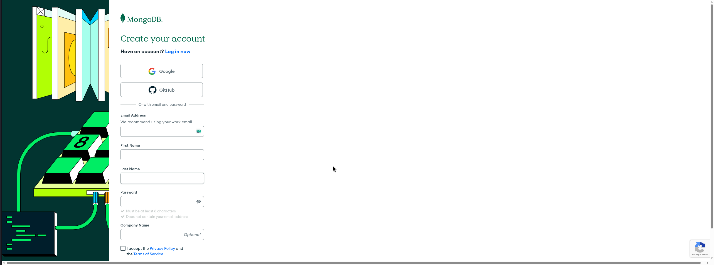
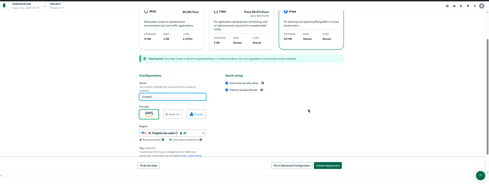
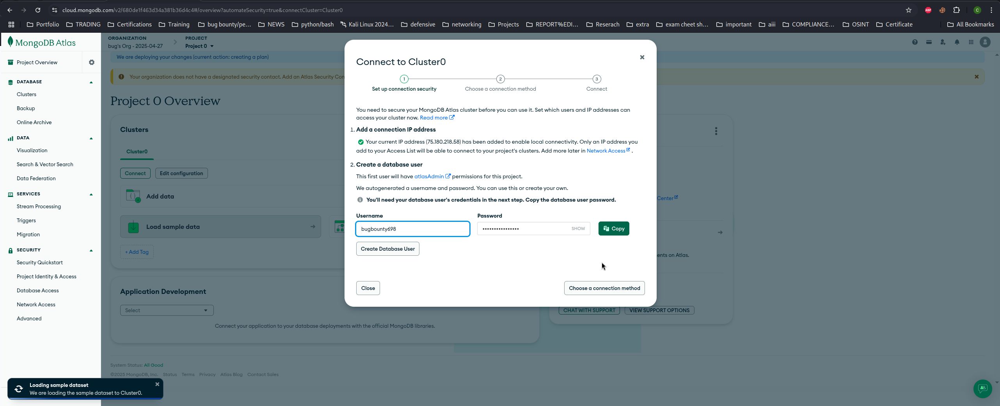
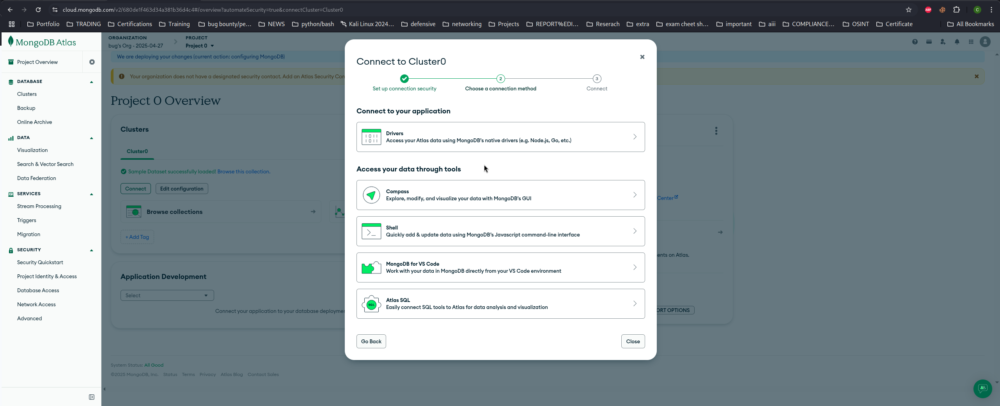
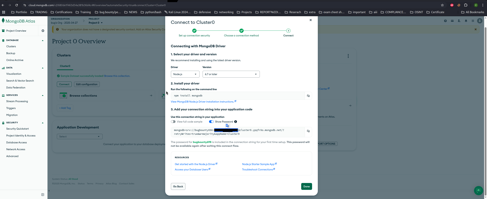

# 4155-study-project

## Project Introduction
Hello! This is our project for ITSC-4155. The aim of our project is to create a study helper for each user! We will accomplish this through this initial functionality:
 1. Letting users sign up
 2. Once a user is signed in, prompt the user to create their studyset
 3. Once a studyset is created, the user will be given a list of options (flashcards, tests) to study in their favorite medium. 
 
## Team Members
 - Ebert Amaya
 - Janie Ita
 - Brody Banner
 - Isaac Reed
 - Nam Pham

## Backend Development
Before setting up the backend development server, you must first create and configure your MongoDB Atlas database.  
To do this, you will need to sign up for a MongoDB Atlas account, deploy a database cluster, set up your connection credentials, and obtain your MongoDB connection URI.  
Once your database is fully configured, you can proceed with setting up the backend project.

1. Create a MongoDB Atlas Account
- Go to MongoDB Atlas. https://account.mongodb.com/account/register
- Sign up using Google, GitHub, or manually with email and password.
  

 
2. Deploy a Cluster
- After logging in, click "Create a Cluster".
-  Choose the Free Tier (Shared Cluster).
-  Select:
-  Provider: AWS (default)
-  Region: N. Virginia (us-east-1) (recommended).
-  Cluster name: leave as default (Cluster0).
-  Click "Create Deployment".
   

3. Connect to Your Cluster

- Click **Connect** next to your cluster.
- MongoDB will automatically detect your IP address.
- It will also **auto-generate a Database User** with random username and password.
- You can accept the auto-generated user, or create your own username and password manually.
- This database user is needed later for your application to connect.
  

4. Choose a Connection Method

- After creating your database user, MongoDB Atlas asks you to **choose a connection method**.
- Select **Drivers** (Node.js, Python, etc.).
  

5. Copy the Connection String

- MongoDB will now display your **connection string**.
- This string is needed to connect from your application.
- Replace `<username>` and `<password>` in the connection string with your database credentials.
 
 
Example connection string:

```bash
mongodb+srv://<username>:<password>@cluster0.p59rbqf.mongodb.net/?retryWrites=true&w=majority&appName=Cluster0
```
The following steps will guide you through the process of setting up your MongoDB Atlas database and configuring your backend application. 
After completing the database setup, you will need to navigate to the `/4155-study-project` folder, create a `.env` file, 
and add your MongoDB connection URI along with the secret key provided by the development team to complete the backend configuration.

Inside your `.env` file, add the following lines:

```env
MONGO_URI=mongodb+srv://<username>:<password>@cluster0.p59rbqf.mongodb.net/?retryWrites=true&w=majority&appName=Cluster0
SECRET_KEY=<secret_key>
```

## Python Virtual Environment Setup (recommended)
**1. Create a virtual environment in the root directory**
```bash
python -m venv venv
```
**2. Activate the virtual environment:**
- On Windows:
```bash
venv\Scripts\activate
```
- On macOS/Linux:
```bash
source venv/bin/activate
```

**3. Install Dependencies**
```bash
pip install -r requirements.txt
```

## Start the Server
In the root directory, run:
```bash
python run.py
```
